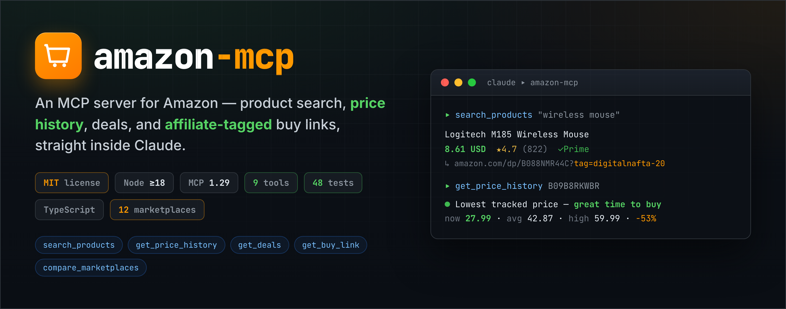
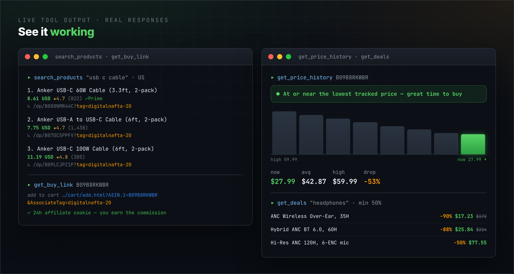
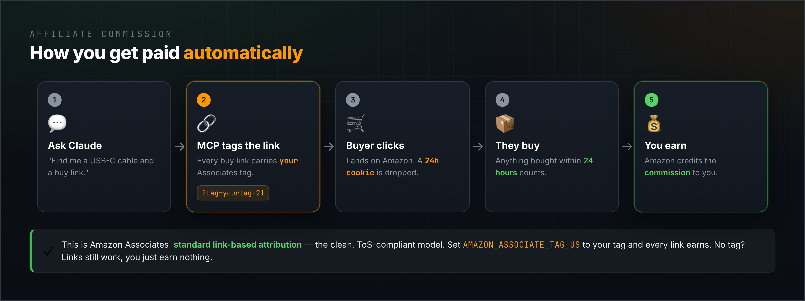
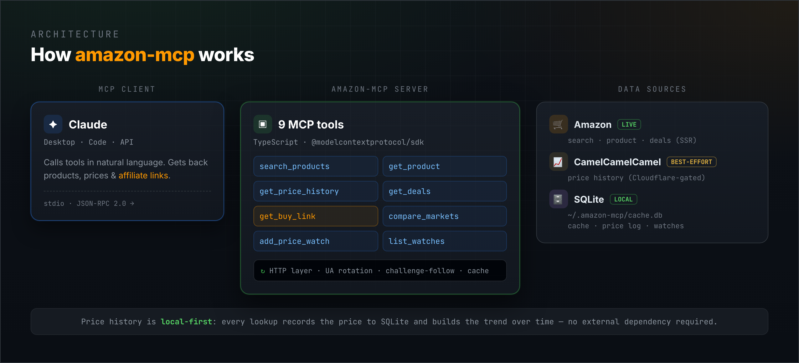

# amazon-mcp

<p align="center">
  
</p>

An MCP server for Amazon: product search, price history (Camelizer-style), deals tracking, and affiliate-tagged purchase links.

[](./LICENSE)
[](https://nodejs.org/)
[](https://modelcontextprotocol.io/)

`amazon-mcp` exposes Amazon shopping capabilities to any [Model Context Protocol](https://modelcontextprotocol.io/) client (Claude Desktop, Claude Code, and others). It searches products, reads CamelCamelCamel price history, finds deals, tracks price drops, compares marketplaces, and — crucially — generates **affiliate-tagged buy links** so your Amazon Associates account earns commission on the purchases it drives.

## Features

- **Product search** — keyword search returning title, price, rating, image, and an affiliate buy link per result.
- **Product details by ASIN** — full details: price, rating, features, availability, brand, and category breadcrumbs.
- **Price history (Camelizer-style)** — a **local price history** that grows as you use it: current / lowest / highest / average prices, percent off the tracked high, and a **buy/wait verdict**. Best-effort [CamelCamelCamel](https://camelcamelcamel.com/) enrichment when reachable (see [Limitations](#limitations)).
- **Deals** — current discounted products, filterable by category keyword and minimum discount percentage.
- **Price-drop watches** — track an ASIN with a target price, stored locally in SQLite; re-check on demand and get flagged when the target is met.
- **Multi-marketplace comparison** — look up the same ASIN across several Amazon marketplaces side by side.
- **Affiliate links, automatically** — your Amazon Associates tracking tag is injected into every product / buy link the server returns, so qualifying purchases earn you commission.
- **12 marketplaces** — US, ES, UK, DE, FR, IT, CA, JP, MX, IN, BR, AU.

## See it working

<p align="center">
  
</p>

## How affiliate commission works

<p align="center">
  
</p>

This server is built around the **standard Amazon Associates link-based attribution** model, which is the legitimate, documented way affiliates earn:

1. Every product and buy link the server returns includes your Associates tracking tag as a query parameter (e.g. `https://www.amazon.com/dp/B08N5WRWNW?tag=yourid-20&linkCode=ll1`).
2. When the user opens that link, Amazon drops a **24-hour tracking cookie** in their browser.
3. Any qualifying purchase that user makes on Amazon within that 24-hour window is **credited to your Associates account**, and you earn the standard commission.

To actually earn, you must:

- Sign up for the Amazon Associates program at **<https://affiliate-program.amazon.com/>** (each marketplace is a separate program with its own tag).
- Configure your real tag(s) via the `AMAZON_ASSOCIATE_TAG_<CODE>` environment variables (see [Configuration](#configuration)).

> If you do not configure a tag, links are emitted **untagged** — they still work, but earn no commission. Every buy-link response states clearly whether a tag was applied. The tag is read from the environment (e.g. a local, git-ignored `.env`) and is never stored in source.

This is link-based attribution, the same mechanism behind any "as an Amazon Associate I earn from qualifying purchases" link. Nothing more.

## Architecture

<p align="center">
  
</p>

## Requirements

- **Node.js >= 18**

## Installation

```bash
git clone https://github.com/JanNafta/amazon-mcp.git
cd amazon-mcp
npm install
npm run build
```

This produces the runnable server at `dist/index.js`.

## Configuration

Configuration is read from environment variables. For local development you can copy `.env.example` to `.env`; MCP clients normally pass these via their config's `env` block instead.

| Variable | Description |
| --- | --- |
| `AMAZON_ASSOCIATE_TAG_US` | Associates tracking tag for the US marketplace (suffix `-20`, e.g. `yourid-20`). |
| `AMAZON_ASSOCIATE_TAG_ES` | Associates tag for Spain (suffix `-21`). |
| `AMAZON_ASSOCIATE_TAG_UK` | Associates tag for the UK (suffix `-21`). |
| `AMAZON_ASSOCIATE_TAG_DE` | Associates tag for Germany (suffix `-21`). |
| `AMAZON_ASSOCIATE_TAG_FR` | Associates tag for France (suffix `-21`). |
| `AMAZON_ASSOCIATE_TAG_IT` | Associates tag for Italy (suffix `-21`). |
| `AMAZON_ASSOCIATE_TAG_CA` | Associates tag for Canada (suffix `-20`). |
| `AMAZON_ASSOCIATE_TAG_JP` | Associates tag for Japan (suffix `-22`). |
| `AMAZON_ASSOCIATE_TAG_MX` | Associates tag for Mexico (suffix `-20`). |
| `AMAZON_ASSOCIATE_TAG_IN` | Associates tag for India (suffix `-21`). |
| `AMAZON_ASSOCIATE_TAG_BR` | Associates tag for Brazil (suffix `-20`). |
| `AMAZON_ASSOCIATE_TAG_AU` | Associates tag for Australia (suffix `-22`). |
| `AMAZON_DEFAULT_MARKETPLACE` | Marketplace used when a call doesn't specify one. One of `US, ES, UK, DE, FR, IT, CA, JP, MX, IN, BR, AU`. Default `US`. |
| `AMAZON_CACHE_TTL_PRODUCT` | Cache TTL in seconds for product/search lookups. Default `3600` (1h). |
| `AMAZON_CACHE_TTL_PRICE_HISTORY` | Cache TTL in seconds for price history. Default `21600` (6h). |
| `AMAZON_CACHE_TTL_DEALS` | Cache TTL in seconds for deals. Default `900` (15m). |
| `AMAZON_CACHE_DB_PATH` | Path to the SQLite cache file. Default `~/.amazon-mcp/cache.db`. |

### About the associate tags

Amazon Associates tags follow the convention `yourname-XX`, where `XX` is a marketplace-specific suffix:

| Suffix | Marketplaces |
| --- | --- |
| `20` | US, CA, MX, BR |
| `21` | ES, UK, DE, FR, IT, IN |
| `22` | JP, AU |

Set the tag that matches each marketplace you care about. There is also a generic `AMAZON_ASSOCIATE_TAG` fallback used when no marketplace-specific tag is set.

Each Associates program is per-country, so a tag from one program (e.g. a US `-20` tag) earns **no commission** on another marketplace. The server does **not** rewrite tags for you, but it **validates** each tag and warns you in the buy-link response when a tag's suffix doesn't match the marketplace it's being used on, or when a tag is malformed (stray spaces, an inline comment left in `.env`, etc.) — so a misconfiguration surfaces instead of silently costing you commission.

## Connecting to Claude Desktop / Claude Code

### Claude Desktop

Add the server to your `claude_desktop_config.json`:

```json
{
  "mcpServers": {
    "amazon": {
      "command": "node",
      "args": ["/absolute/path/to/amazon-mcp/dist/index.js"],
      "env": {
        "AMAZON_ASSOCIATE_TAG_US": "yourtag-20",
        "AMAZON_DEFAULT_MARKETPLACE": "US"
      }
    }
  }
}
```

Restart Claude Desktop and the `amazon` tools will be available.

### Claude Code

Register the server with the CLI:

```bash
claude mcp add amazon -- node /absolute/path/to/amazon-mcp/dist/index.js
```

You can pass environment variables with `-e`, for example:

```bash
claude mcp add amazon -e AMAZON_ASSOCIATE_TAG_US=yourtag-20 -e AMAZON_DEFAULT_MARKETPLACE=US -- node /absolute/path/to/amazon-mcp/dist/index.js
```

## Available tools

The server registers **9 tools**. Every tool that accepts a `marketplace` argument falls back to `AMAZON_DEFAULT_MARKETPLACE` when omitted.

### `search_products`

Search Amazon for products by keyword. Returns title, price, rating, image, and an affiliate purchase link for each result.

| Argument | Type | Required | Description |
| --- | --- | --- | --- |
| `query` | `string` | yes | Search keywords, e.g. `mechanical keyboard`. |
| `marketplace` | enum | no | Amazon marketplace. Defaults to the configured default. |
| `limit` | `integer` (1–40) | no | Max results. Default `16`. |

### `get_product`

Fetch full details for a product by ASIN: title, price, rating, features, availability, brand, breadcrumbs, plus an affiliate buy link. Also logs the price to local history.

| Argument | Type | Required | Description |
| --- | --- | --- | --- |
| `asin` | `string` (10-char ASIN) | yes | e.g. `B08N5WRWNW`. |
| `marketplace` | enum | no | Amazon marketplace. |

### `get_price_history`

Price history and buy/wait analysis for an ASIN. Builds a **local price history** over time — each lookup records the current price, then computes lowest / highest / average and a buy-wait verdict from your own tracked data. It also makes a best-effort attempt at CamelCamelCamel and merges its numbers when reachable (see [Limitations](#limitations)). The more often you look a product up, the richer its trend.

| Argument | Type | Required | Description |
| --- | --- | --- | --- |
| `asin` | `string` (10-char ASIN) | yes | The ASIN to analyze. |
| `marketplace` | enum | no | Amazon marketplace. |

### `get_deals`

Find current discounted products on Amazon, optionally filtered by category keyword and minimum discount. Each deal includes an affiliate buy link.

| Argument | Type | Required | Description |
| --- | --- | --- | --- |
| `category` | `string` | no | Category/keyword to filter deals, e.g. `headphones`. Omit for general deals. |
| `minDiscountPct` | `integer` (1–99) | no | Only return deals with at least this % off. |
| `marketplace` | enum | no | Amazon marketplace. |
| `limit` | `integer` (1–40) | no | Max deals. Default `20`. |

### `get_buy_link`

Generate affiliate-tagged purchase links for an ASIN: a product page link and a one-click add-to-cart link. Opening either drops a 24h Amazon affiliate cookie so the configured Associates account earns commission on the purchase.

| Argument | Type | Required | Description |
| --- | --- | --- | --- |
| `asin` | `string` (10-char ASIN) | yes | The ASIN to buy. |
| `marketplace` | enum | no | Amazon marketplace. |
| `quantity` | `integer` (1–30) | no | Quantity for the add-to-cart link. Default `1`. |

### `compare_marketplaces`

Look up the same ASIN across several Amazon marketplaces and compare prices side by side. Each row includes an affiliate buy link. Prices are in each marketplace's local currency, and the same ASIN may not exist everywhere.

| Argument | Type | Required | Description |
| --- | --- | --- | --- |
| `asin` | `string` (10-char ASIN) | yes | The ASIN to compare. |
| `marketplaces` | `array` of enum (2–8) | no | Marketplaces to compare. Default `US, UK, DE, ES`. |

### `add_price_watch`

Track an ASIN and remember a target price. Use `list_price_watches` later to re-check; when the current price is at or below the target, the watch is flagged as triggered.

| Argument | Type | Required | Description |
| --- | --- | --- | --- |
| `asin` | `string` (10-char ASIN) | yes | The ASIN to watch. |
| `targetPrice` | `number` (> 0) | yes | Notify when price is at or below this value. |
| `marketplace` | enum | no | Amazon marketplace. |

### `list_price_watches`

List all saved price watches. When `checkNow` is true, re-fetches the current price for each watched ASIN, updates the stored last price, and reports which targets are met.

| Argument | Type | Required | Description |
| --- | --- | --- | --- |
| `checkNow` | `boolean` | no | Re-fetch current prices and update watches. Default `false`. |

### `remove_price_watch`

Delete a saved price watch by its id (from `list_price_watches`).

| Argument | Type | Required | Description |
| --- | --- | --- | --- |
| `id` | `integer` (> 0) | yes | Watch id to remove. |

## Example prompts

Once connected, ask Claude things like:

- "Search Amazon for a mechanical keyboard under $100"
- "What's the price history of B08N5WRWNW? Is it a good time to buy?"
- "Find me headphone deals with at least 30% off"
- "Give me a buy link for B08N5WRWNW"
- "Compare the price of B08N5WRWNW across US, UK and Germany"
- "Watch B08N5WRWNW and tell me when it drops below $50"

## Supported marketplaces

| Code | Domain |
| --- | --- |
| `US` | www.amazon.com |
| `ES` | www.amazon.es |
| `UK` | www.amazon.co.uk |
| `DE` | www.amazon.de |
| `FR` | www.amazon.fr |
| `IT` | www.amazon.it |
| `CA` | www.amazon.ca |
| `JP` | www.amazon.co.jp |
| `MX` | www.amazon.com.mx |
| `IN` | www.amazon.in |
| `BR` | www.amazon.com.br |
| `AU` | www.amazon.com.au |

## How price history works

Price history is **local-first**. Every time a product price is fetched (via `get_product`, `get_price_history`, or a `checkNow` watch refresh), the server records it to a **local SQLite history** at `~/.amazon-mcp/cache.db`. `get_price_history` then computes lowest / highest / average and how far the current price sits below the tracked high, and derives a human **buy/wait verdict**:

- *"At or near the lowest tracked price — great time to buy"*
- *"Below average — good deal"*
- *"Around the average price"*
- *"Above average — consider waiting"*
- *"Not enough history yet — look this product up a few more times to build a trend"*

This means a product's trend **starts empty and grows as you use it**. To seed a baseline quickly, look a product up a few times (or add a price watch and refresh it with `checkNow`).

The server also makes a **best-effort** attempt at **[CamelCamelCamel](https://camelcamelcamel.com/)** and merges its numbers when reachable — but CCC is Cloudflare-protected and usually unavailable over plain HTTP (see [Limitations](#limitations)). The same SQLite database backs the response cache and stored price watches.

## Limitations

This server scrapes public HTML, so it is subject to the anti-bot measures of the sites it reads. Observed behavior:

- **CamelCamelCamel is Cloudflare-protected.** Its product pages and chart CDN return `HTTP 403` ("Just a moment…") to plain HTTP clients, so live CCC history/charts are generally **not** available without a real browser. The server detects this and transparently falls back to local price tracking. If you need full historical data on day one, plug in the [Keepa API](https://keepa.com/#!api) (official, not blocked) — the price-history layer is structured so an alternative source can be added.
- **Some Amazon marketplaces serve an AWS WAF JS challenge** (observed on `amazon.co.uk`). When that happens a request can't be scraped over HTTP and the tool reports it clearly instead of failing silently. The US marketplace is the most reliable; others vary by IP and load.
- **Product-page prices are best-effort.** Amazon hydrates the price with JavaScript on many detail pages, so `get_product` may return a `null` price even when the page loads. `search_products` is server-rendered and returns prices reliably — prefer it when you need a price.
- **No proxies / no JS engine.** The client rotates user-agents, follows bot-manager meta-refresh challenges (carrying cookies), retries with backoff, and detects CAPTCHA / WAF / Cloudflare pages — but it does not solve JS challenges or rotate IPs. Under heavy use Amazon may rate-limit the source IP temporarily.

For a fully reliable, ToS-clean data source, use the official **[Amazon Product Advertising API](https://webservices.amazon.com/paapi5/documentation/)** (requires an approved Associates account) or **Keepa** for price history.

## Development

```bash
npm run dev        # run the server from source with tsx (loads .env)
npm test           # run the test suite (vitest)
npm run typecheck  # type-check without emitting (tsc --noEmit)
npm run build      # compile TypeScript to dist/
```

## Disclaimer

This project performs **web scraping of public pages** on Amazon and CamelCamelCamel. Respect their Terms of Service and rate limits, and use it at your own responsibility. It is **not affiliated with, endorsed by, or sponsored by Amazon** or CamelCamelCamel. "Amazon" and related marks are trademarks of Amazon.com, Inc. or its affiliates. Scraped sites can change their markup or block automated access at any time; the server degrades gracefully but results are not guaranteed.

> **Associates Operating Agreement note.** Link-based affiliate attribution (tagging a buy link) is the legitimate, documented way Associates earn. However, **sourcing the underlying product data by scraping Amazon** — rather than via the official [Product Advertising API](https://webservices.amazon.com/paapi5/documentation/) — can conflict with the [Amazon Associates Operating Agreement](https://affiliate-program.amazon.com/help/operating/agreement) and Amazon's `robots.txt`/Conditions of Use, and has been cited in account terminations. If you rely on your Associates income, prefer the PA-API (which requires an approved account and qualifying sales) or [Keepa](https://keepa.com/#!api) as the data source, and treat this server's scraping tools as a convenience for personal/experimental use. You are responsible for your own compliance.

## License

[MIT](./LICENSE) © 2026 Jan Nafta
